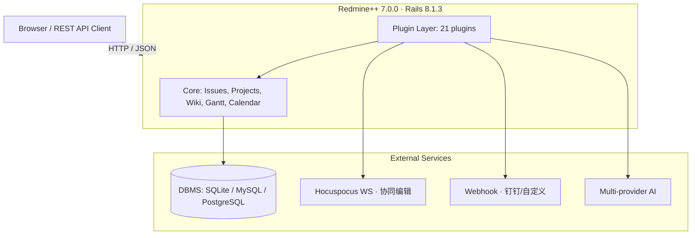

# Redmine++

> 灵活的项目管理与问题跟踪系统 · Flexible project management & issue tracking

[](https://github.com/redmine-plus-plus/redmine-plus-plus)
[](https://www.ruby-lang.org/)
[](https://rubyonrails.org/)
[](plugins/)
[](LICENSE.txt)

---

## 概览 / Overview

Redmine++ 是基于 **Ruby on Rails** 构建的开源项目管理和问题跟踪工具，
基于上游 Redmine 7.0.0 增强分发。本仓库集成了 21 个社区/自研插件，覆盖了
看板、协同编辑、AI 助手、Webhook、网盘、清单等扩展能力。

```text
┌─────────────────────────────────────────────────────────────┐
│                      Redmine++ 7.0.0                         │
│  Issues · Projects · Wiki · Gantt · Calendar · Boards · API │
├─────────────────────────────────────────────────────────────┤
│  21 Plugins  │  AI · Dashboard · Drive · Checklists · Yjs …  │
├─────────────────────────────────────────────────────────────┤
│   Rails 8.1.3  │  Ruby ≥ 3.2  │  SQLite / MySQL / PostgreSQL  │
└─────────────────────────────────────────────────────────────┘
```

---

## 技术架构 / Architecture



---

## 技术栈 / Stack

| 维度        | 选型                                              |
| ----------- | ------------------------------------------------- |
| 语言        | Ruby `>= 3.2.0, < 4.1.0`                          |
| 框架        | Ruby on Rails `8.1.3`                             |
| 数据库      | SQLite `≥ 2.9.4` · MySQL `≥ 0.5.0` · PostgreSQL `≥ 1.6.2` |
| 富文本      | CommonMark / Textile（Loofah 过滤）              |
| 前端        | Stimulus · Propshaft · Tabler Icons · Chart.js    |
| 测试        | Minitest · System Tests                           |
| 许可        | MIT                                                |

---

## 核心特性 / Highlights (v7.0.0)

### 平台与依赖
- **Rails 8** 框架升级（#43205），原生支持 **Ruby 4.0**（#43650）
- HTML 过滤由 `html-pipeline` 迁移至 **Loofah**（#42737），安全性与可维护性提升
- 移除 IE 兼容 CSS、Raphael.js 依赖，全面转向 **SVG API**（#43388, #43845）

### 界面与体验
- 全新**导航栏式页头**重构，视觉更轻量（#43937）
- 引入 **Open Color** 统一 CSS 色板（#43256），全面采用 CSS 逻辑属性改善 RTL/LTR（#43515, #43700）
- 顶栏用户相关链接升级为**独立用户菜单**（#31353）
- 附件列表以**文件类型图标**替代回形针（#43797, #43805）

### 附件与预览
- 支持 **Microsoft Office / LibreOffice Writer** 文件预览（#8959）
- **PDF** 附件与仓库条目改为内联预览而非下载（#22483）
- 新增 **AVIF** 图像支持（#43943），修复 SVG 预览以图像展示（#44126）

### 问题与跟踪
- 新增问题**私密标记默认值**（#9432）、**截止日期相对偏移**（#31518）
- 经办人下拉支持「按用户组」展示与排序配置（#43996, #44015）
- 时间列在问题列表**右对齐**（#43615）

### 协同与自动化
- 原生 **Webhook 触发器**（#29664）
- 文本格式化支持**粘贴表格为 Markdown/Textile**（#43950）、**Tab 缩进**（#44061）
- **甘特图**代码拆分为视图 + Stimulus 控制器，并改善 RTL（#43397, #43678）
- Wiki 支持**批量导出全部页面为 ZIP**（#43978）

### 性能与安全
- `@mention` 自动补全**缓存**与首屏建议上限，缓解大规模用户实例渲染开销（#43838, #44194, #44190）
- API / Atom 访问密钥**记录最后使用时间**（#43938）
- 默认管理员邮箱改为 `admin@dummy.invalid`，**Sudo 模式默认开启**（#43808, #44052）

完整变更见 [`CHANGELOG.md`](CHANGELOG.md)（历史明细见 `doc/CHANGELOG`）。

---

## 插件矩阵 / Plugin Matrix

| 插件 | 版本 | 分类 | 说明 | 作者 |
| --- | --- | --- | --- | --- |
| `additionals` | 4.3.0-main | 基础/库 | 仪表盘、Wiki 宏等易用性增强，插件底层库 | AlphaNodes |
| `additional_tags` | 4.3.0-main | 标签 | 为问题 / Wiki 提供标签支持 | AlphaNodes |
| `redmine_ai_assistant` | 1.0.0 | AI | 悬浮聊天窗、工作报告生成、多供应商 AI | xindu.site |
| `redmine_calendar` | 1.0.4 | 日历 | 拖拽、双击建单、右键菜单增强 | carolcoral |
| `redmine_checklists` | 4.0.0 | 清单 | 问题 Checklist 清单管理 | RedmineUP |
| `redmine_dashboard` | 2.16.0 | 看板 | 任务板与计划板 | Jan Graichen |
| `redmine_depending_custom_fields` | 0.0.8 | 自定义字段 | 级联 / 联动自定义字段 | Jan Catrysse |
| `redmine_drive` | 1.2.3 | 文档 | 跨设备文件存储、共享与访问 | RedmineUP |
| `redmine_issue_dynamic_edit` | 1.0.0 | 问题 | JIRA 式详情页内联动态编辑 | Hugo Zilliox |
| `redmine_issue_edit_online` | 1.0.0 | 问题 | 免刷新动态更新问题属性 | carolcoral |
| `redmine_indicator` | 0.4.0 | 指标 | 我的页面 / 项目页主指标块 | Frederic Aoustin |
| `redmine_issues_tree` | — | 问题 | 问题列表树状视图 | Ivan Zabrovskiy |
| `redmine_lightbox3` | 1.1.0 | 附件 | 灯箱预览图片与 PDF | tomy |
| `redmine_logo` | 1.0.3 | 主题 | 可定制 Logo（文字 / 图片）、自定义 head | carolcoral |
| `redmine_questions` | 1.0.7 | 协作 | Q&A 问答插件 | RedmineUP |
| `redmine_reminder` | 1.0.1 | 通知 | 临近 / 逾期任务提醒邮件 | carolcoral |
| `redmine_resources` | 2.0.6 | 资源 | 资源分配与管理 | RedmineUP |
| `redmine_watermark` | 1.0.1 | 附件 | 附件水印 | AiYuHang |
| `redmine_webhook` | 1.0.4 | 集成 | Webhook 通知（支持钉钉） | carolcoral |
| `redmine_wiki_text_colorizer` | 0.1.4 | Wiki | 文本 / 背景颜色按钮 | sk-ys |
| `redmine_yjs` | 0.0.4 | 协作 | 基于 Yjs CRDT 的协同编辑 | d-led |

---

## 快速开始 / Quick Start

### 方式一：一键启动脚本（推荐）

仓库根目录提供了 `setup-redmine.sh`，自动完成「系统依赖检查 → 配置生成 → 依赖安装
→ 密钥生成 → 数据库迁移 → 默认数据 → 插件迁移 → 启动服务」全流程：

```bash
# 完整安装并启动（开发环境，默认 SQLite / 端口 3000 / 中文默认数据）
bash setup-redmine.sh

# 生产环境安装并启动（自动预编译静态资源，端口 80）
bash setup-redmine.sh prod

# 仅启动已就绪的实例（跳过所有设置步骤）
bash setup-redmine.sh start

# 更换数据库类型（自动保护已有数据，仅增量迁移）
DB_ADAPTER=postgresql bash setup-redmine.sh

# 清空并重建数据库（危险，需显式确认）
RESET_DB=1 bash setup-redmine.sh reset
```

脚本默认账号 `admin / admin`，访问 `http://localhost:3000`。
常用子命令：`start` · `prod` · `create-db` · `reset` · `backup` · `cleanup` · `test-email`。
可通过环境变量定制：`DB_ADAPTER` · `RAILS_ENV` · `REDMINE_PORT` · `REDMINE_BIND`
· `REDMINE_LANG` · `RESET_DB` · `AUTO_CONFIRM` · `QUIET_MODE`。

### 方式二：手动步骤

```bash
# 1. 安装依赖
bundle install

# 2. 生成密钥
bundle exec rake generate_secret_token

# 3. 创建数据库并迁移（以生产环境为例）
bundle exec rake db:migrate RAILS_ENV=production
bundle exec rake redmine:load_default_data RAILS_ENV=production

# 4. 启动（协同编辑需另起 Hocuspocus WebSocket 服务）
bundle exec rails server -e production
```

> 插件无需额外迁移，Redmine 启动时会自动加载 `plugins/` 下的各插件。
> 协同编辑插件（`redmine_yjs`）依赖独立的 Hocuspocus WebSocket 服务。
> 一键脚本已内置插件迁移（`redmine:plugins:migrate`），手动部署时若安装插件也建议执行一次。

---

## 系统要求 / Requirements

| 组件 | 最低要求 |
| --- | --- |
| Ruby | `>= 3.2.0`, `< 4.1.0` |
| Ruby on Rails | `8.1.3` |
| 数据库 | SQLite ≥ 2.9.4 / MySQL ≥ 0.5.0 / PostgreSQL ≥ 1.6.2 |
| 浏览器 | 现代 Chromium / Firefox / Safari |
| 其他 | 协同编辑需 Hocuspocus WS |

---

## 目录结构 / Layout

```text
redmine/
├── app/                 # 核心 MVC、视图、资源
├── plugins/             # 21 个插件（详见上方矩阵）
├── lib/                 # 核心库（含 Redmine 引擎）
├── config/              # 路由、数据库、环境配置
├── db/                  # 数据迁移与结构
├── public/              # 静态资源
└── doc/                 # 文档（含完整 CHANGELOG）
```

---

## 许可证 / License

Redmine++ 遵循 **MIT License**。
原 Redmine 代码版权 © 2006- Jean-Philippe Lang。
第三方组件许可见 `doc/licenses`。
